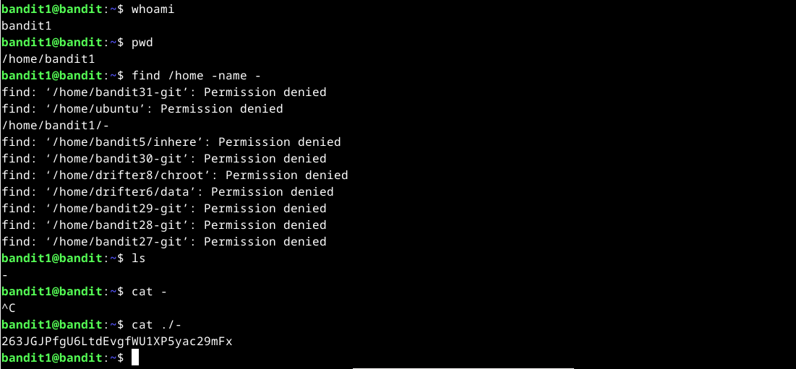

# Hacking Lab set up
## Debian Installation on an Oracle Virtual Box VM
1. Download Oracle Virtual Box which can be done [here](https://www.virtualbox.org/wiki/Downloads).
2. Download the Debian ISO File which can be retrieved from [here](https://cdimage.debian.org/debian-cd/current/amd64/iso-cd/debian-12.9.0-amd64-netinst.iso).
3. Create a new virtual machine in Oracle virtual Box by navigating to the menu --> Machine --> New
4. Name the virtual machine and select the ISO image
5. Set the amount of RAM, CPU and storage and finish the process
6. Start the virtual machine
7. Choose in the boot loader the option "Debian GNU/Linux live" and start the instalation process
8. Once the OS is ready test some basic functions such as browser and settings
9. If the tests are good, run the "Install Debian" installer (Calamares)  and go through the wizzard and adjust it to your liking (English language is recommended as online information is in english), Location and Keyboard as to your liking!
10. For the partition it is best to erase the virtual disk if no specific partitions shall be done
11. Add any additional users if needed and then start the installation
12. Do a snapshot after completion!

## Linux command line basics
| Linux Command               | Description                                                                                                                                                                                                                 |
|-----------------------------|-----------------------------------------------------------------------------------------------------------------------------------------------------------------------------------------------------------------------------|
| `pwd`                       | Prints the current working directory, showing where you are in the filesystem.                                                                                                                                              |
| `ls`                        | Lists files and directories in the current working directory.                                                                                                                                                               |
| `cd [directory]`            | Changes the current directory to the specified one; `cd ..` moves up one directory level.                                                                                                                                   |
| `less [file]`               | Opens a text file in a viewer; space advances pages, 'b' moves back, '/' searches, and 'q' exits.                                                                                                                           |
| `nano [file]`               | Opens the nano text editor to create or edit a file; use `CTRL-X`, then 'y', and 'Enter' to save and exit.                                                                                                                  |
| `mkdir [directory]`         | Creates a new directory with the specified name.                                                                                                                                                                            |
| `mv [source] [destination]` | Moves or renames a file or directory; if the destination is an existing directory, the source is moved into it.                                                                                                             |
| `cp -r [source] [destination]` | Copies files or directories recursively; the `-r` flag ensures that directories and their contents are copied.                                                                                                           |
| `rm [file]`                 | Removes a file; use with caution as there's no trash or undo.                                                                                                                                                               |
| `rm -r [directory]`         | Removes a directory and its contents recursively; be very careful with this command.                                                                                                                                        |
| `ssh [user]@[host]`         | Opens a secure shell session to a remote machine; replace `[user]` with your username and `[host]` with the remote host's address.                                                                                          |
| `scp -r [source] [user]@[host]:[destination]` | Securely copies files or directories to a remote machine; the `-r` flag is for recursive copying.                                                                                                              |
| `man [command]`             | Displays the manual page for a command, providing detailed information and options.                                                                                                                                         |
| `[command] --help`          | Shows a brief help message and available options for the specified command.                                                                                                                                                 |
| `history`                   | Lists previously executed commands in the current session.                                                                                                                                                                  |
| `apt-get update`            | Updates the list of available packages from the repositories; often run before installing new software.                                                                                                                     |
| `apt-get install [package]` | Installs the specified package; use `-y` to automatically answer 'yes' to prompts.                                                                                                                                          |
| `apt-get purge [package]`   | Removes the specified package along with its configuration files.                                                                                                                                                           |
| `dpkg --listfiles [package]` | Lists all files installed by the specified package; useful for finding executable paths.                                                                                                                                   |
| `w`                         | Displays who is currently logged into the system and their activity.                                                                                                                                                        |
| `finger [user]`             | Provides information about a specific user, including login time and terminal.                                                                                                                                              |
| `ping [host]`               | Sends ICMP echo requests to a host to check network connectivity; use `CTRL-C` to stop.                                                                                                                                     |
| `wget [URL]`                | Downloads files from the internet; use `-r` for recursive downloads and `-np` to avoid ascending to the parent directory.                                                                                                   |
| `links [URL]`               | Opens a text-based web browser to view websites in the terminal; alternatives include `lynx`, `w3m`, `glinks`, and `elinks`.                                                                                                |
| `tab`                       | Pressing the 'Tab' key auto-completes commands or filenames; pressing it twice shows available options.                                                                                                                     |
| `arrow keys`                | The up arrow retrieves the previous command; left and right arrows move the cursor within the current command line for editing.                                                                                             |
| `ctrl-R`                    | Initiates a reverse search through command history; type a part of the command to find it.                                                                                                                                  |
| `/`                         | The root directory, the top of the filesystem hierarchy.                                                                                                                                                                    |
| `/home/`                    | Contains home directories for all users; e.g., `/home/tero/` is the home directory for user 'tero'.                                                                                                                         |
| `/etc/`                     | Stores system-wide configuration files in human-readable text format.                                                                                                                                                       |
| `/media/`                   | Mount point for removable media like CDs and USB drives; e.g., `/media/cdrom/` or `/media/usbdisk/`.                                                                                                                        |
| `/var/log/`                 | Contains system-wide log files; e.g., `/var/log/syslog` and `/var/log/apache2/error.log`.                                                                                                                                   |

## Can't Fish

"ip addr show" is used to list network interfaces, showing that the adapter enp0s3 is active with an IP address. 
Network connectivity is confirmed with a successful ping 8.8.8.8. The interface is then disabled using sudo "ip link set enp0s3 down". 
Afterwards a ping to 8.8.8.8 fails with Network is unreachable, confirming that the network is disabled.

## Port scan

### Command and Parameters
The sudo prefix ensures the command is executed with superuser privileges. This is important as this command requires that. The nmap tool is used to identify open ports and services running on them, therefore it was installed at the beginning via "sudo apt install nmap"
The -A parameter enables advanced features like operating system detection, service version identification and a traceroute to map the network path. The target is localhost, which has the IP address 127.0.0.1.

### Scanning Process
1. Nmap begins the scan, followed by a warning ("it is unable to determine any DNS servers"), which means reverse DNS lookups are disabled. But this is not a problem as we scan localhost
2. As soon as nmap confirms that local host is up, it proceeds with the actual scanning of open ports and services
3. The scan shows the TCP ports 22 (SSH), 25 (SMTP), and 631 (IPP). SSH is used for remote sessions, SMTP is used for sending E-Mails and IPP is used for print jobs over networks.
4. Next to the services the scan shows the operating system (Linux kernel from the 2.6.x series)
5. The scan took in total 0 Network hops

### ELI5 (Explain Like I’m 5)
We used a tool called Nmap to "ask" the computer, What doors are open, and what it is doing behind them?
The computer replied Door 22, 25 and 631 are open at the moment. Behind the doors I am doing some work, such as running SSH to allow secure logins, running an E-Mail service to send E-Mails and maniging printers.

It is generally recommended to close the ports which are not used for security reasons. Why shall a door be left open only why nobody or nothing is in there?

## Daemon scan
### Apache2 installation

### Difference to scan without daemon
Now that the webserver has been installed and started port 80 (http) is activated. Port 443 (https) could also be enabled if a valid ceritficat is installed and ssl should be used which is from a security matters not even a question!

The rest is equal, as no ports have been deactivated.

## Bandit oh-five
### Level 0
The goal of this level is for you to log into the game using SSH. The host to which you need to connect is bandit.labs.overthewire.org, on port 2220. The username is bandit0 and the password is bandit0. Once logged in, go to the Level 1 page to find out how to beat Level 1.

First I installed ssh with sudo apt install ssh and then I could login to the bandit as shown in the screenshot.

### Level 0 --> 1
The password for the next level is stored in a file called readme located in the home directory. Use this password to log into bandit1 using SSH. Whenever you find a password for a level, use SSH (on port 2220) to log into that level and continue the game.

With the find command I found the file and got the first password.

### Level 1 --> 2
The password for the next level is stored in a file called - located in the home directory

After logging in with the user 1 I also used the find command to find the pw as shown in the screenshot.

### Level 2 --> 3
The password for the next level is stored in a file called spaces in this filename located in the home directory

The same concept applied here only that I had to search the file in "" as there were spaces in it. Otherwise the system could not handle it.

### Level 3 --> 4
The password for the next level is stored in a hidden file in the inhere directory.

Here the hidden file had to be found with the command ls -la

### Level 4 --> 5
The password for the next level is stored in the only human-readable file in the inhere directory. Tip: if your terminal is messed up, try the “reset” command.

I iterrated to the first files before I wanted to start filtering ;P

### Level 5--> 6
The password for the next level is stored in a file somewhere under the inhere directory and has all of the following properties:
* human-readable
* 1033 bytes in size
* not executable

This time I used the find filter and searched for the file size as shown in the picture.

# References
Debian ISO Image: https://cdimage.debian.org/debian-cd/current/amd64/iso-cd/debian-12.9.0-amd64-netinst.iso
Oracle Virtual Box download: https://www.virtualbox.org/wiki/Downloads
Installation of virtual machine: https://terokarvinen.com/2021/install-debian-on-virtualbox/
Linux commands: https://terokarvinen.com/2020/command-line-basics-revisited/
Bandit game: https://overthewire.org/wargames/bandit/
