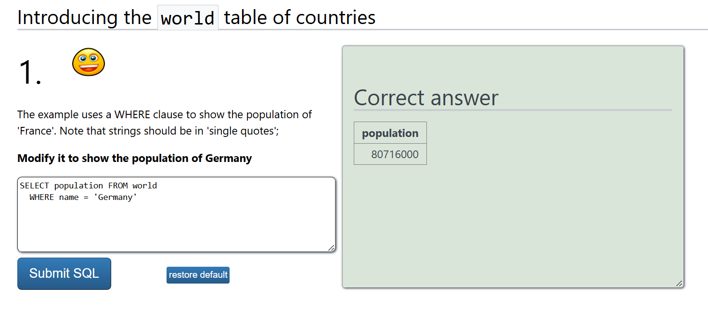
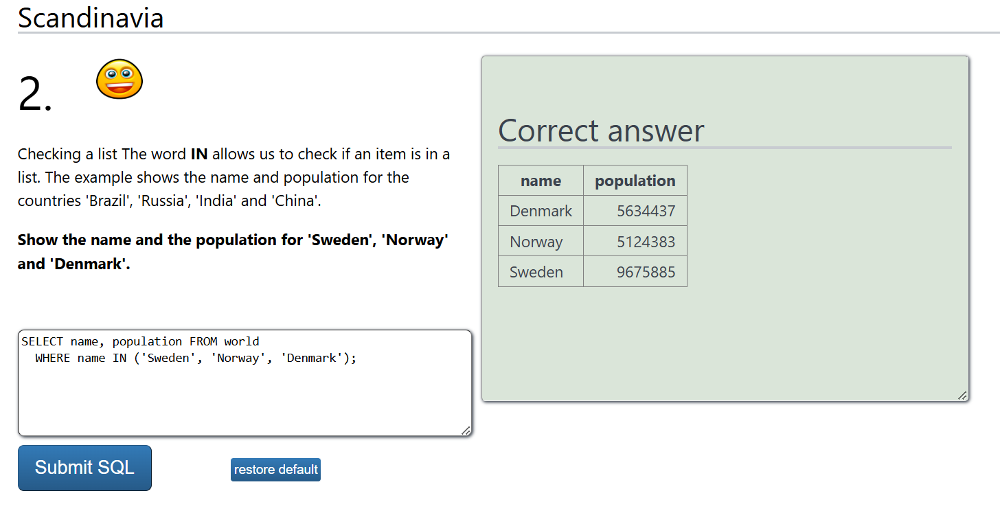
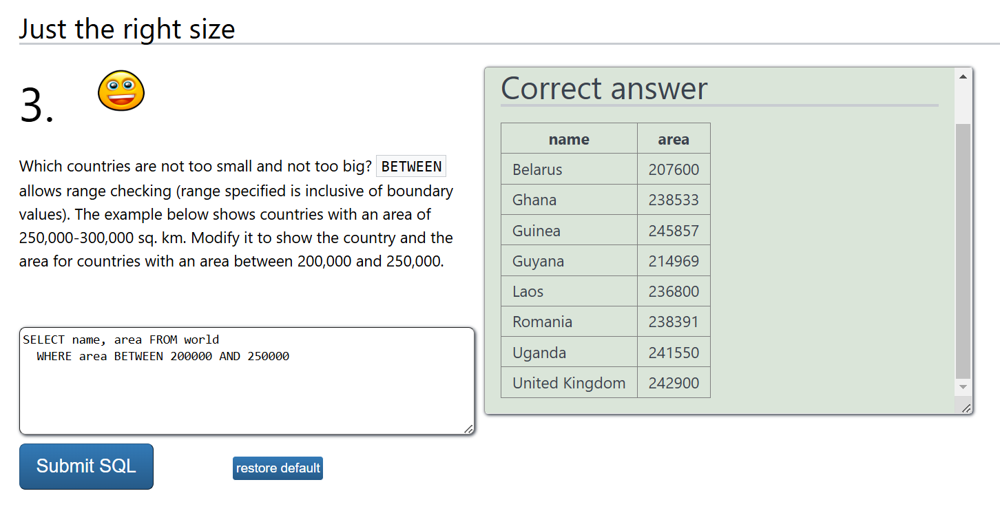
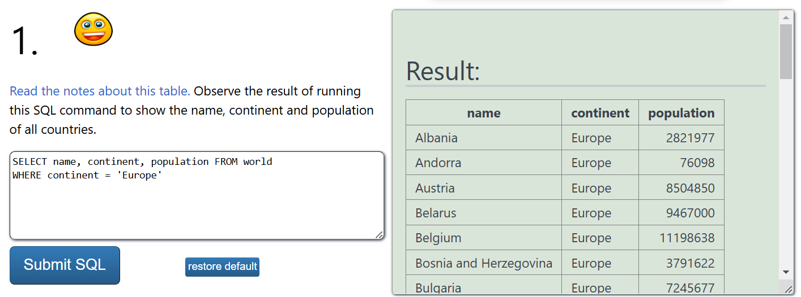
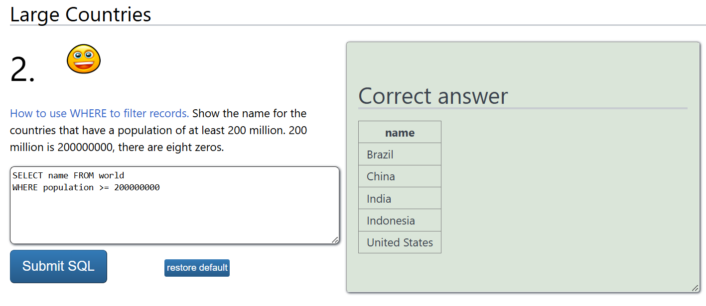

# h4 Johnny Tables

## Broken Access Control
Broken Access Control is a security vulnerability that occurs when an application improperly enforces restrictions on user actions. It results to allowing unauthorized access to sensitive data or functions.
Hackers can take advantage of this to see, change or delete data. Furthermore, they can even act as admins without permission sometimes. 

### Vulnerabilites
* Violating the principle of least privilege or failing to deny access by default. These mistakes lead to the provision of access to unauthorized users
* Bypassing access controls by modifying URLs, internal application states, or HTML pages
* Allowing unauthorized viewing or editing of another user's account by manipulating unique identifiers
* Missing access controls for critical API Call methods (POST, PUT, DELETE)
* Privilege escalation, such as acting as a user without logging in or as an admin when logged in as a regular user
* Manipulation of metadata such as tampering with JSON Web Tokens (JWTs), cookies or hidden fields to elevate privileges
* Misconfiguring Cross-Origin Resource Sharing (CORS), allowing API access from unauthorized origins
* Forcefully browsing to authenticated or privileged pages without proper authorization

### Prevention
To stop it, apps should block access by default and make sure permissions are checked properly. There are also other ways to achieve that:
* Deny access by default if it is not for public resources
* Implement access control mechanisms centrally and use them throughout the application to minimize CORS usage
* Enforce record ownership in access controls to prevent unauthorized data manipulation
* Apply unique business limit requirements through the domain models
* Disable web server directory listings and ensure sensitive files are not within web roots
* Log access control failures and alert administrators when appropriate with monitoring tools
* Rate-limit API and controller access to reduce the impact of automated attacks
* Invalidate stateful session identifiers on the server after logout
* Use short-lived JWT tokens to minimize the windows of opportunity for attackers

### Example attack scenarios
#### Privilege Escalation via Role Manipulation
##### Scenario 1
A regular user intercepts a request and modifies their role from "user" to "admin" in a poorly protected application:
```json
{
   "username": "john_doe",
   "role": "admin"
}
```
If the system accepts this change the user gains admin privileges without authorization.

##### Scenario 2
A user changes the userID parameter in an API request to access another user's data:
```bash
GET /api/user/1234/profile
```
Changing 1234 to 5678 allows unauthorized access to another user’s profile if proper access controls aren’t enforced.

##### Scenario 3 
An application uses unverified data in a SQL query to access account information. An attacker modifies the 'acct' parameter in the browser to access another user's account:
```
https://example.com/app/accountInfo?acct=notmyacct
```

##### Scenario 4
An attacker forcefully browses to URLs requiring administrative rights:
```
https://example.com/app/getappInfo
```
```
https://example.com/app/admin_getappInfo
```
If a non-admin user can access the admin page, it's a security flaw.

## Security Misconfiguration
Security misconfiguration arises when applications or systems are improperly configured and not monitored. This leaves them weak and defensless to attacks.
### Vulnerabilites
* Leaving default usernames and passwords active allows attackers extrem easy access
* Running services or features that aren't needed increases the attack surface and risks
* Displaying detailed errors can reveal sensitive information to attackers who think logically
* Not applying security patches makes systems vulnerable to known exploits
  
### Prevention
* Implement a repeatable hardening Process
* Minimize platform features, by removing unnecessary features, components, and services
* Update and patch systems on a regular basis or as soon as vendors publish them
* Use segmentation and containerization to isolate components and limit potential damage from a breach
* Implement monitoring tools which react on attacks and inform the administrators
* Conduct penetration tests to find vulnerabilities
 
### Example attack scenarios
#### Scenario 1
##### Default password on admin account of a website
The administrator does not change the default password for some reason and the hacker gains access to his account without even trying much

#### Scenario 2
##### Unremoved Sample Applications
An application server retains default sample applications post-deployment. Attackers exploit known vulnerabilities in these samples to compromise the server.

#### Scenario 3
##### Verbose Error Disclosure
An application displays detailed error messages such as the password is incorrect instead of the "authentication failed". Attackers leverage this information and only try to figure out the password now.

## Vulnerable and Outdated Components
This issue happens when applications use outdated libraries, frameworks, or software modules. These components may have known vulnerabilities that attackers can directly exploit.

### Vulnerabilites
The common vulnerabilities here are:
* Unpatched Libraries
* Unsupported Software of vendors
* Unverified Dependencies
* Running the systems not on actual versions

### Prevention
In order to prevent these attacks to happen the following measures can be conducted:
* Keep a detailed list of all components and their versions for client-side and server-side in order to stay on the newest versions
* Use automated tools to identify vulnerabilities in components and their dependencies
* Apply security updates to address known vulnerabilities
* Obtain components from official sources and prefer signed packages to ensure authenticity
  
### Example attack scenarios
#### Scenario 1
##### Unpatched Framework
An application uses an outdated version of a web framework with a known vulnerability. Attackers exploit this flaw with their knowledge to execute arbitrary code on the server.

#### Scenario 2
##### Deprecated Library
A component in the application relies on a deprecated library that no longer receives security updates. Attackers exploit a known vulnerability in this library to gain unauthorized access.

## Injection
Injection happens when specific data is sent to a system as part of a command or query. This allows attackers to execute unintended commands or access unauthorized data.

### Vulnerabilites
The dangers are:
* Unvalidated user entries by the system
* Dynamic queries or commands that don’t use safe methods
* Leaving open gaps for SQL Injection, cross-site scripting or command Injection
  
### Prevention
* Implement specific form checks where malicous strings are not accepted prior to being sent
* Use Parameterized Queries which mploy prepared statements to separate data from code
* Properly escape user inputs based on the interpreter's context
  
### Example attack scenarios
#### Scenario 1
##### SQL Injection 
An attacker modifies a URL parameter to execute a malicious SQL query
```sql
http://example.com/app/account?id=' OR '1'='1
```
This example could allow unauthorized access to all user accounts, since 1 equals to 1 ;P

#### Scenario 2
##### Command Injection 
A web application passes user input directly to a shell command
```python
os.system("ping -c 1 " + user_input)
```
If an attacker provides ; rm -rf /, it could delete critical files on the server since it is also a relative path

## Reflection 
### Questions 
1. What are the best practices for implementing role-based access control (RBAC) securely?
2. What are the most common misconfigurations that attackers exploit in cloud-based applications?
3. How do modern frameworks help prevent SQL injection and other injection-based attacks?

### Ideas
#### 1. Idea during SQL injection
Instead of just escaping user input, applications could implement strict input whitelisting, ensuring only predefined, expected values are accepted, significantly lowering the risk of injection attacks.

#### 2. Idea during Broken access control
Multi-factor authentication (MFA) alone isn’t enough—systems should also enforce strict session management to prevent unauthorized users from hijacking authenticated sessions.

## Exploits of a Mom


### What happend?
A mother gave her son a very special name "Robert'); DROP TABLE Students;--", which causes database damage when the school's system tries to store his name. 
The joke lies in how the name is formatted. It is an SQL command. All the students entries are gone after this SQL injection as DROP table deletes a table.
Unfortunately no referential integrity has been applied here and especially no cyber security! 

### What most likely happend in the school's database system
The application might be running an SQL query like this when inserting a Roberts name into the database:
```sql
INSERT INTO Students (Name) VALUES ('Robert'); DROP TABLE Students;--');
```

### How it could have been prevented
* Useage of prepared statements with parameterized queries
* Escape of special characters in user input
* Restriction of database permissions to prevent unauthorized table deletion
* Validation of the whole user string input

## Web goat 
### Installation
For this task I followed Tero's page


### b) F12. Solve Webgoat 2023.4: General: Developer tools
The first task was quite easy as I am already familiar with the devtools


However the second task requried a little bit of searching as I did not notice the request button first. But afterwards I found the post request which gave me the network number


## c) Not outdated. Update all operating system and all applications in your Linux.
In order to update my whole machine I ran the following commands
```bash
sudo apt update
sudo apt upgrade -y
sudo apt full-upgrade -y
```
This process took a while...

## d) Sequel
### 0 SELECT Basics




### 2 SELECT FROM WORLD
#### "1. You can use WHERE..."


#### "2. Find the countries...".


## e) Solve Portswigger Labs
### Explain how and why! 
This vulnerability exists because the application concatenates user input directly into an SQL query, which allows an attacker to manipulate the query logic. 
By injecting OR 1=1--, an attacker modifies the WHERE clause to always return true, bypassing filters and exposing hidden data. 
The issue arises due to a lack of input checks and the failure to use parameterized queries, which would otherwise prevent SQL code execution.

### How can you find the vulnerabitiy? 
In order to find the vulnerability I had to look where I can enter some strings.
Here it was the url, but it could also be searchbars or registration forms. 
The rule is to locate where something can be typed in.

### What each part of the exploit does?
When an attacker modifies the URL:
```
https://0a6400a903909bc48df15154005f00ee.web-security-academy.net/filter?category=Accessories%27%20OR%201=1--
```

The SQL query changes to:
```sql
SELECT * FROM products WHERE category = 'Accessories' OR 1=1--' AND released = 1;
```

Hence 'Accessories' Closes the original category string. OR 1=1 Always evaluates to TRUE, making the WHERE clause useless.
-- Comments out the rest of the query (AND released = 1), bypassing the restriction.  This forces the database to return all products, including hidden/unreleased ones.

## m) Voluntary bonus: WebGoat: SQL Injection

## n) Voluntary bonus: solve some Portswigger labs marked as Apprentice (easy level)

## References
* Broken access control: https://owasp.org/Top10/A01_2021-Broken_Access_Control/
* Broken access control: https://cheatsheetseries.owasp.org/cheatsheets/Insecure_Direct_Object_Reference_Prevention_Cheat_Sheet.html
* Security misconfiguration: https://owasp.org/Top10/A05_2021-Security_Misconfiguration/
* Vulnerable and outdated components: https://owasp.org/Top10/A06_2021-Vulnerable_and_Outdated_Components/
* Injection: https://owasp.org/Top10/A03_2021-Injection/
* Injection: https://snyk.io/de/blog/command-injection-python-prevention-examples/
* Exploits of a Mom: https://xkcd.com/327/
* Web goat installation: https://terokarvinen.com/2023/webgoat-2023-4-ethical-web-hacking/
