# h5 Uryyb, Greb!
## Summary of Applied Crypographie Chapter 1
### 1.1 Terminology
- Sender & Receiver: Communication involves a sender transmitting a message to a receiver. This process requires nowadays encryption since you don't know who else is listening.
- Messages & Encryption: 
  - Plaintext (M): Original message.
  - Encryption (E): Converts plaintext into **ciphertext**.
  - Decryption (D): Converts ciphertext back to plaintext.
- Cryptography: The science of secure communication.
- Cryptanalysis: The practice of breaking ciphertext.
- Cryptology: Encompasses both cryptography and cryptanalysis.

#### Key concepts:
- Authentication: Verifying the sender's identity.
- Integrity: Ensuring the message hasn’t been altered.
- Nonrepudiation: Preventing the sender from denying their message.

### **1.2 Algorithms and keys**
- Cryptographic algorithm (Cipher): Mathematical functions for encryption and decryption.
- Key:A secret value used for encryption and decryption. The range of possible keys is the **keyspace**.
- Symmetric algorithms: Use the same key for encryption and decryption
- Public-Key algorithms: Use different keys for encryption and decryption. Only public keys are exchanged!

#### **Cryptosystem:** 
A combination of an algorithm, plaintexts, ciphertexts, and keys.

### **1.3 Types of Cryptographic Algorithms**
1. Symmetric algorithms: Single key for encryption and decryption.
   - Types: 
     - Stream ciphers: Encrypt data bit-by-bit.
     - Block ciphers: Encrypt fixed-size blocks such as 64 bits
2. Public-Key Algorithms: Use a pair of keys which consists of public for encryption and private for decryption (RSA)

### **1.4 Cryptanalysis (Attacks on Cryptosystems)**
- Ciphertext-only attack: The attacker only has access to ciphertext.
- Known-plaintext attack: The attacker has both plaintext and corresponding ciphertext.
- Chosen-plaintext attack: The attacker can choose plaintext for encryption.
- Adaptive-chosen-plaintext attack: The attacker refines the attack based on previous results.
- Chosen-ciphertext attack: The attacker can decrypt chosen ciphertexts.
- Chosen-key attack: Exploits relationships between keys.
- Rubber-hose cryptanalysis: Coercion or bribery to obtain keys.

### **1.5 Security of Algorithms**
- **Breaking an Algorithm:** Different levels:
  - **Total break:** Discovering the exact key.
  - **Global deduction:** Finding an equivalent decryption method without the key.
  - **Instance deduction:** Recovering plaintext for specific ciphertexts.
  - **Information deduction:** Gaining partial information about keys or plaintext.
- **Unconditional security:** Only **one-time pads** provide this level of security.
- **Computational security:** The algorithm is infeasible to break with current technology.

### **1.6 Steganography**
- Conceals the existence of messages rather than just encrypting them.
- Modern methods include hiding messages in images by altering the least significant bits of pixels.

## **1.7 Classical Ciphers**
- **Substitution Ciphers:** Replace each character with another.
  - **Simple (Monoalphabetic):** One-to-one substitution.
  - **Homophonic:** Multiple ciphertext options for each plaintext character.
  - **Polygram:** Encrypts groups of characters.
  - **Polyalphabetic:** Uses multiple substitution alphabets (e.g., Vigenère cipher).
- **Transposition Ciphers:** Rearrange the order of characters without altering them.
  - Example: Columnar transposition cipher.
- **Rotor Machines:** Mechanical encryption devices, such as the German **Enigma**.


## PGP - Send Encrypted and Signed Message
The protocol PGP (pretty good privacy) is used to send encrypted messages in order to protect the exchanged data.
In order to set that up the following key steps are required

### PGP Encryption, Signing and Verification with GPG
GPG has to be installed along with useful tools like `micro` (a lightweight text editor) and `killall` from `psmisc`. After installation, a **GPG key pair** is generated using:
```bash
gpg --gen-key
```

### Exporting the Public Key
Once the key pair is generated, the **public key** needs to be exported so others can encrypt messages:

```bash
gpg --export --armor --output bob.pub
```

This creates a file `bob.pub`, which is shared with Alice.

### Simulating Alice’s Environment
To properly test encryption, a **separate environment** is created for Alice. A new directory is set up, and permissions are adjusted:

```bash
mkdir alice_home  
chmod 700 alice_home  
```

Inside this directory, Alice generates her own GPG key pair:

```bash
gpg --homedir alice_home --gen-key  
```

### Importing Public Keys
Alice imports Bob’s public key (`bob.pub`) to her keyring, allowing her to send encrypted messages:

```bash
gpg --homedir alice_home --import bob.pub  
```

To confirm the key's authenticity, its fingerprint is verified.

### Encrypting and Signing a Message
A message is written and saved as `message.txt`. To ensure security, it is **encrypted and signed** using Bob’s public key:

```bash
gpg --homedir alice_home --encrypt --sign --armor --output message.asc --recipient "Bob DEMO KEY" message.txt  
```
This produces an **ASCII-armored** encrypted file `message.asc`, which Alice sends to Bob.

### Decrypting and Verifying the Message
Upon receiving `message.asc`, Bob decrypts and verifies it using:

```bash
gpg --decrypt message.asc  
```

If the encryption and signature are valid, the original message is displayed on the screen with a confirmation that the signature is verified.

---

This process ensures that messages remain **securely encrypted and authenticated**. Once the setup is complete, encrypted and signed communication can continue securely between Alice and Bob.

## a) Install OpenSSH server, connect to it using 'ssh' client.
I have already installed SSH for the bandit over the wire tasks. But the command would be:
```bash
sudo apt update && sudo apt install -y openssh-server
```
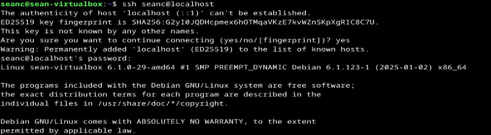


## b) Automate SSH connection using public keys.
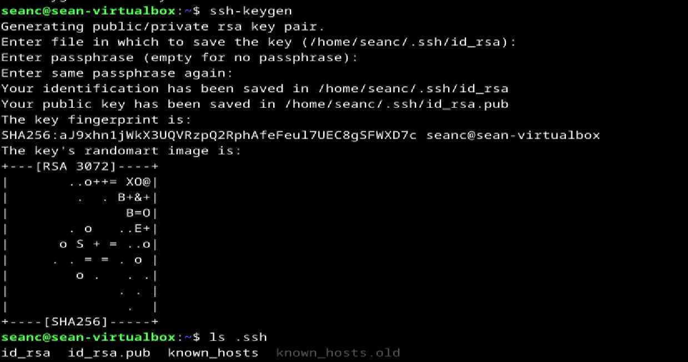

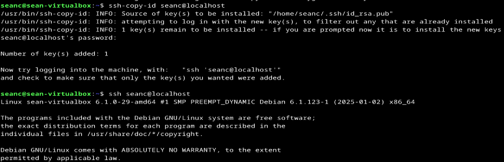

## c) Pretty Good indeed. 
Encrypt and decrypt a message with 'gnupg', using PGP public key cryptography. (Note that here you learn each step; for end users, you can often automate and make it look simple)
### Installation of GnuPG
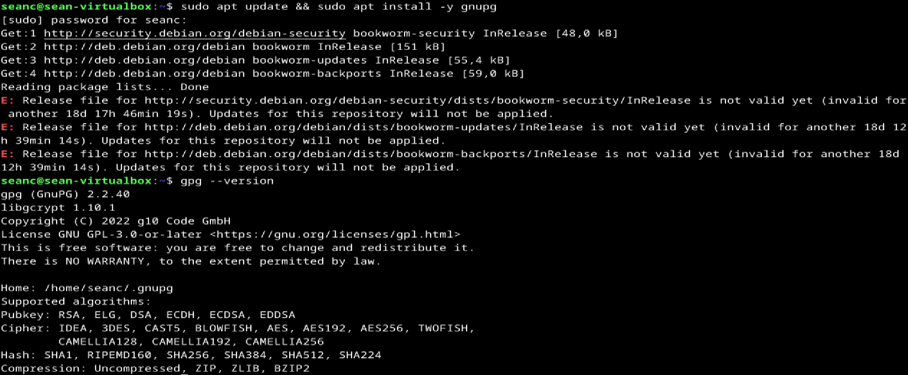
### Generation of Keypair pgp
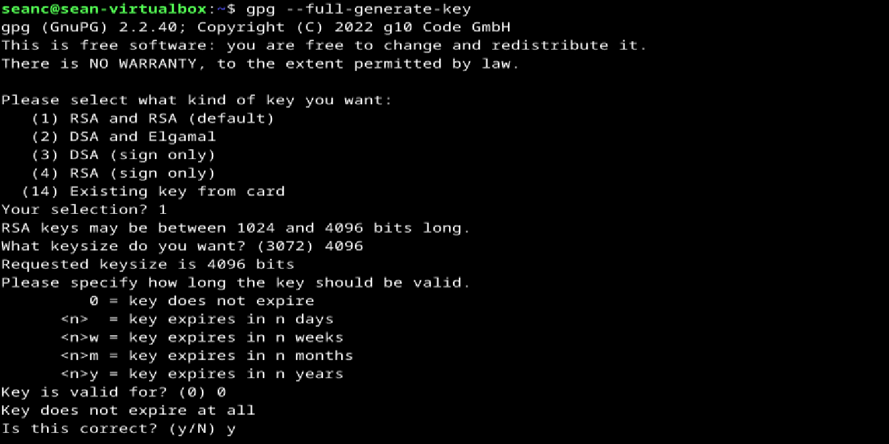
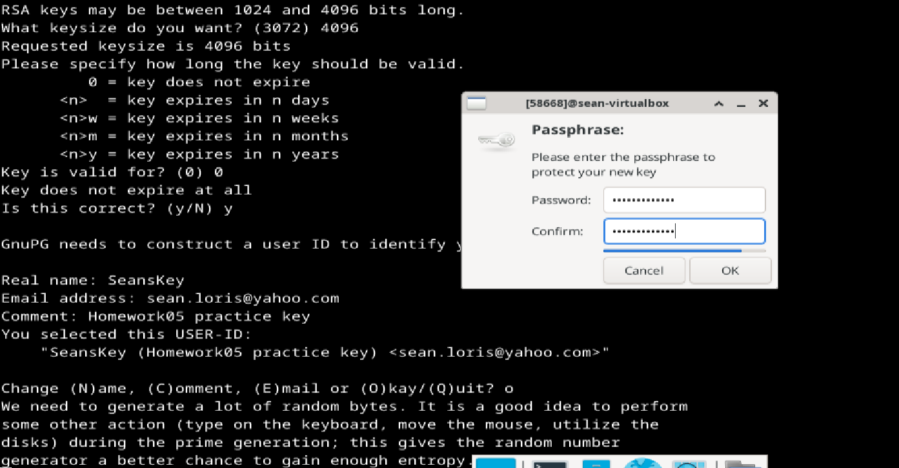
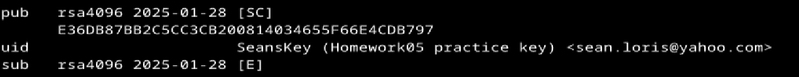

### Export and Import Siumlation of public key
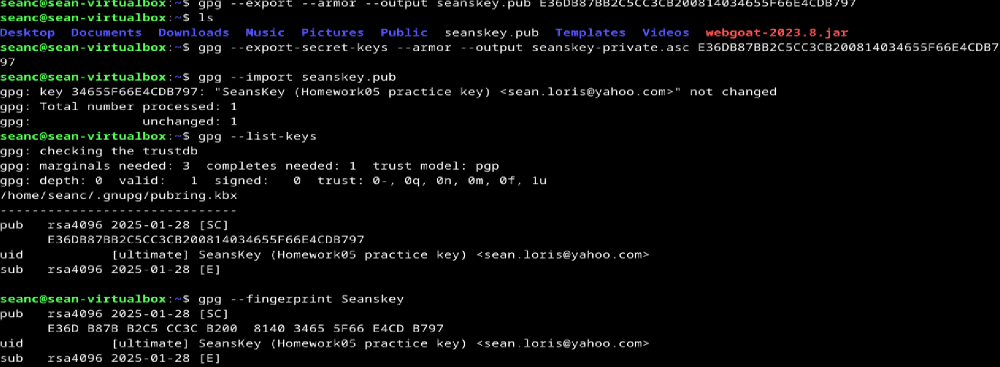

### Message encryption
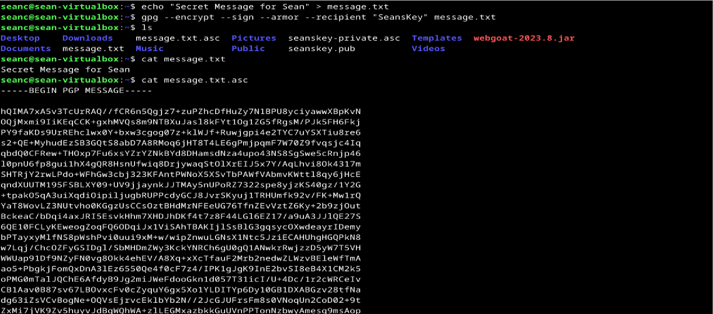

### Message decryption
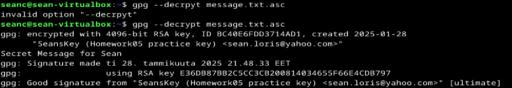

## d) Password manager, open and cloudless. 
Choose a password manager that 1) works without cloud 2) is free, open source sofware. 

### Install it


### Demonstrate its use. 
Passwords can be stored in a password database securely. You dont have to remember them and can copy paste the passwords into the websites.
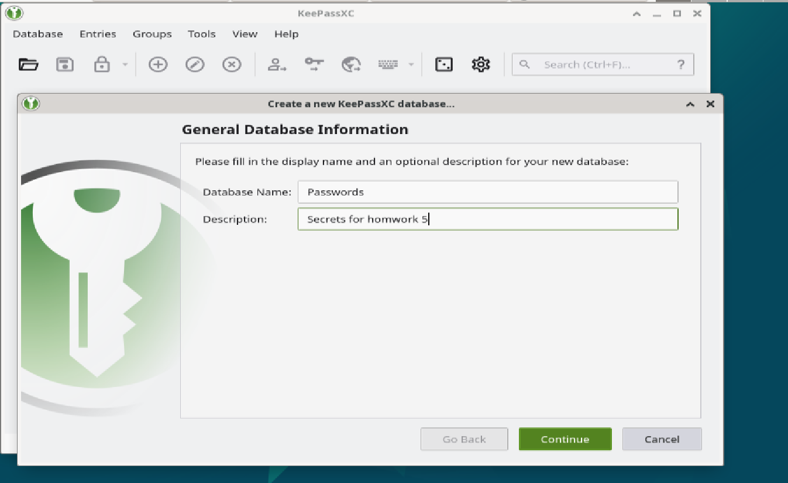
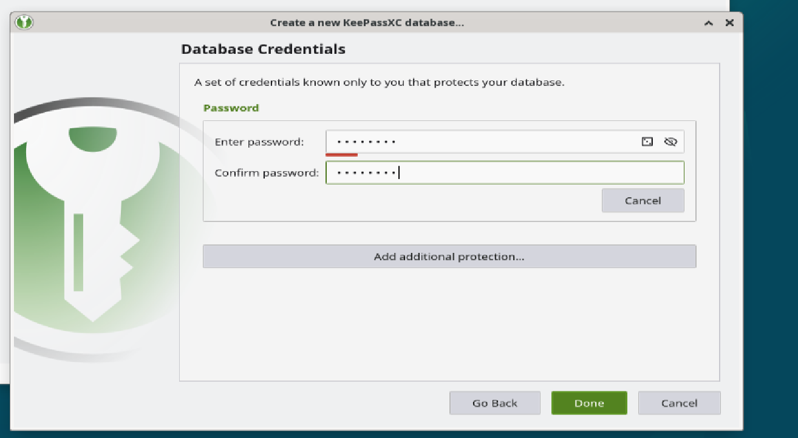
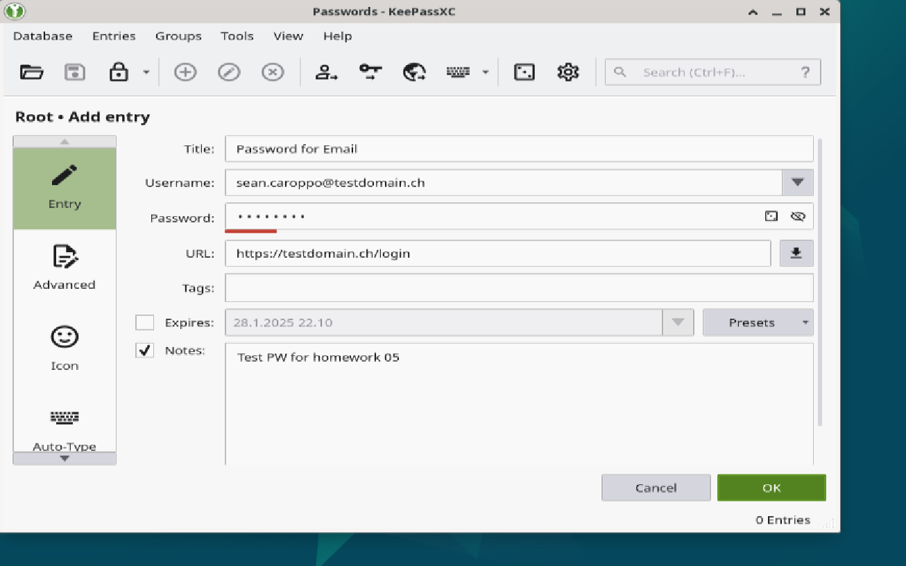
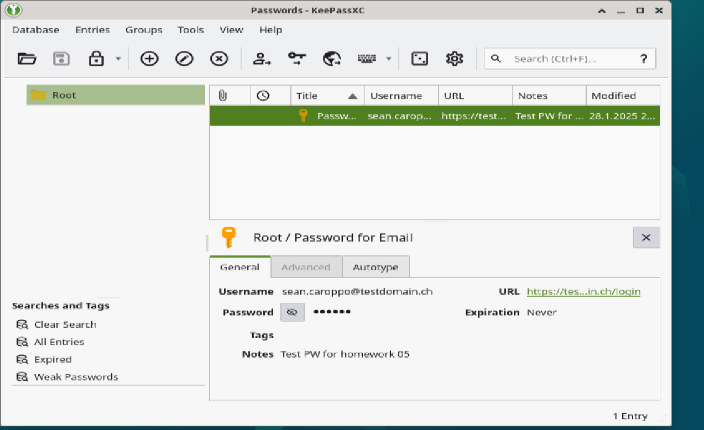

### Explain why a password manager is needed i.e. what kind of attacks or threats it protects against.
A password manager is essential for keeping your accounts secure. Without one, people tend to use weak passwords or reuse the same ones across multiple sites, making them easy targets for hackers. One major risk is password reuse attacks—if a hacker gets one password from a breached website, they can try it on other accounts. A password manager prevents this by storing a unique password for every account. Another threat is phishing, where fake websites trick users into entering their login details. 

Furthermore, it helps by autofilling only on real sites, so you don’t accidentally enter your credentials on a scam page. Keyloggers, which record everything typed on a keyboard, can steal passwords. Since a password manager auto-fills login details, it helps protect against keylogging attacks. Using long and complex passwords is one of the best defenses against brute force attacks, where hackers try millions of combinations to guess a password. A password manager generates and remembers strong passwords for you. It also solves the issue of forgotten passwords—instead of writing them down or resetting them constantly, you just remember one master password, and the manager securely stores the rest. 

In short, a password manager makes security easy and automatic. It protects against hacks, phishing, keyloggers, and weak passwords—so you stay safe online with minimal effort.

## o) Voluntary bonus frequency distribution of letters
Find out frequency distribution of letters for a language that you know (other than English). 
What are the six most common letters? (This subtask y does not require tests with a computer if the question can be answered without them)

The following table shows the approximate frequency of letters in the Spanish language:

| Rank | Letter | Frequency (%) |
|------|--------|--------------|
| 1    | **E**  | 13.72%       |
| 2    | **A**  | 11.72%       |
| 3    | **O**  | 8.44%        |
| 4    | **S**  | 7.20%        |
| 5    | **N**  | 6.83%        |
| 6    | **R**  | 6.41%        |

These percentages are from an analysis of a Spanish text comprising **2,129,690 characters** across various literary genres.

## r) Voluntary bonus TLS
Choose a transport layer security (TLS) certificate used for the web. 
### Explain key fields. 
A TLS certificate is a digital document used to secure communication between a web server and a client. It ensures that data is encrypted and verifies the server's identity.
A certificate consits of the following elements:
* Subject Common Name: Identifies the entity the certificate is issued for. THese are normally domains like www.google.com
* Issuer: Certificate authority that issued the certificate. Famous issuers are DigiCert or Let's Encrypt (Btw Digicert certificates are very expensive for enterprises!)
* Serial Number: A unique identifier for the certificate. It can be handy to search the certificate with that or do configurations on the server using the serial number.
* Public Key: The cryptographic key used for encryption and verifying signatures.
* Validity Period: The start and expiration dates of the certificate. Yes..... certificates expire and this can cause a great deal of issues in PROD if it is not changed before expiry!
* Subject Alternative Names: Lists other domains covered by the certificate. An example can be that a Web application requires multiple server nodes for DR scenatios. The domains of the servers will be also covered in the certificate. (server1.haagahelia.fi and server2.haagahelia.fi could be covered by webapp.haagahelia.fi). If direct configs are made the servers are trusted.
* Signature Algorithm: The cryptographic algorithm used for signing, such as SHA-256 with RSA.
* Certificate Fingerprint: A unique hash of the certificate to ensure it hasn't been tampered with.

### How do you / browser know it's legit? 
Each certificated which is issued follows a hirearchical structure which is called the chain of trust.
It has normally the following structure: Root cert --> Intermediate Cert --> Leaf cert

When accessing www.google.com, the browser verifies the website’s TLS certificate to ensure a secure connection. 
This trust relies on a Chain of Trust, connecting to Google’s certificate to itsa trusted root certificate. 

The steps are as followed:
1. Google’s Certificate: The server presents a TLS certificate, proving its identity for google.com.
2. Chain of trust: The certificate is signed by an intermediate certificate authority, which is further signed by the Root CA.
3. Root certificates: Trusted root certificates are pre-installed in operating systems or browsers. These certificates come from approved certificate authorities, vetted by OS and browser vendors on a regular bases.
4. Verification process: The browser checks that the following points are matched:
* Signature: Ensures the certificate was signed by a trusted CA.
* Domain: Confirms the certificate matches google.com.
* Validity: Verifies the certificate is active and not expired.
* Revocation: Checks the certificate’s status through an Online Certificate Status Protocol (OCSP) or a Certificate Revocation List (CRL).

If the certificate fails any check, the browser warns about an insecure connection.

### Who says so?
The Certificate Authorities which are for instance trusted organizations that issue and validate certificates like  DigiCert. They undergo hard audits to maintain that power!
Companies can also issue their self signed certificates for their own IT environment in order to establish trust between their applications.
Each Browser or operating system possesses a trust store that maintains a list of trusted root certificates. When accessing a website trust is established as long as the chain of trsut can be verified!

## t) Voluntary bonus rot13: 
Try rot13, the military grade top-secret encryption of the top-2 empire of year zero. 
I visited the Website https://rot13.com/ and played a bit around with some words. Since I already had this at school once I knew what kind of cipher it was.

### Could double rot13 provide extra security? 
Not at all, haha!

###W Why?
ROT13 is a simple Caesar cipher that shifts each letter in the alphabet by 13 positions. 
Since the alphabet has 26 letters and the rotation is 13 (half) it does not make sense to apply it twice as it returns the original text back.

Let's do an example:
1. Secret message: "This is a Secret Message"
2. First ROT13: "Guvf vf n Frperg Zrffntr"
3. Second ROT13: "This is a Secret Message"

## References
PGP Knowlegde: https://terokarvinen.com/2023/pgp-encrypt-sign-verify/
o) voluntary bonus: https://www.sttmedia.com/characterfrequency-spanish

