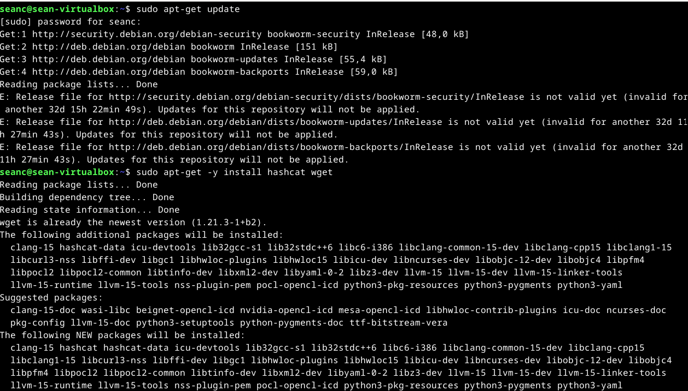
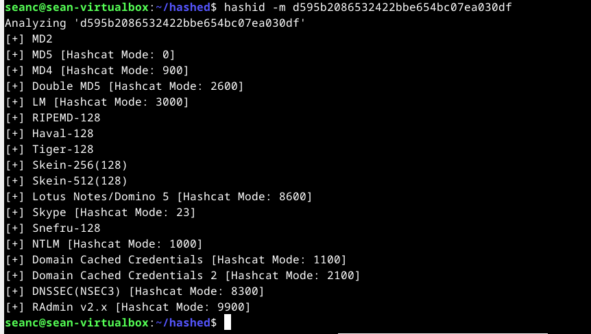
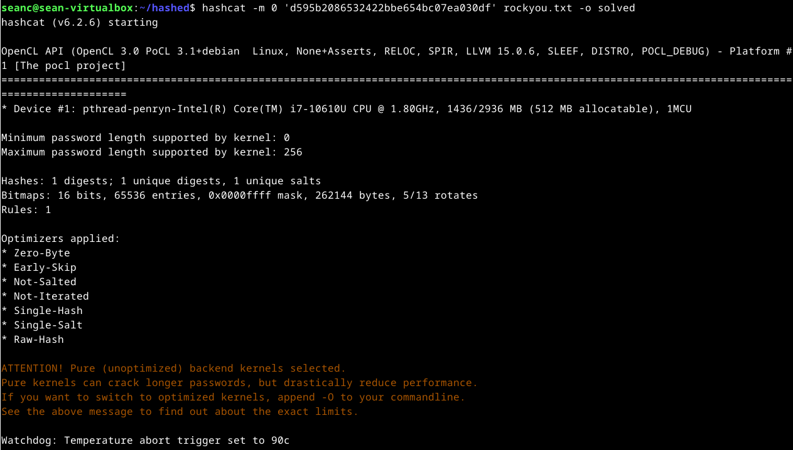
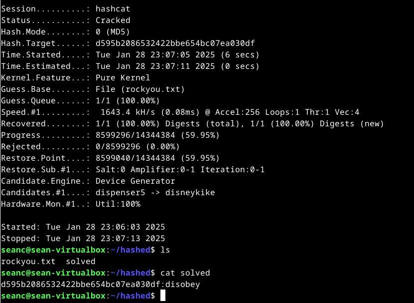
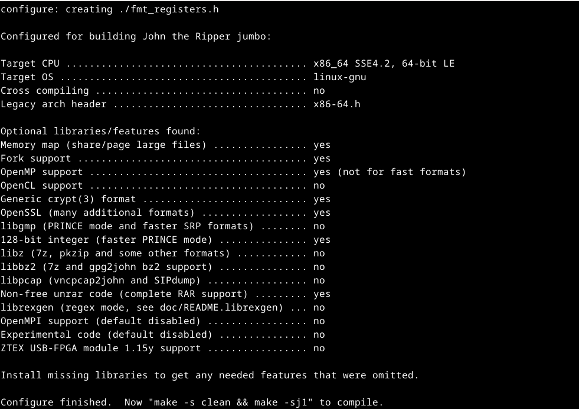
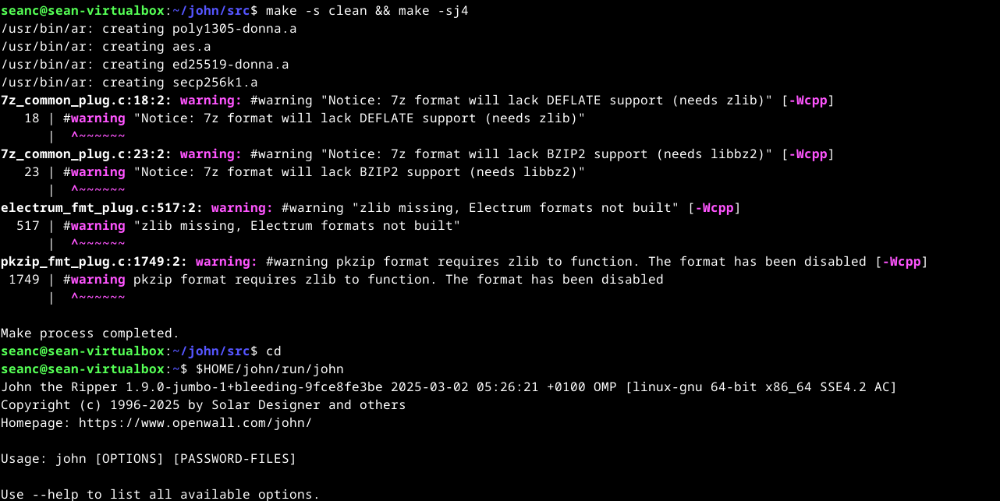

# h6 February2025!
## One-way functions
One-way functions are an important idea in public-key cryptography. They are easy to do in one direction but very hard to reverse. 
For example, breaking a plate into pieces is easy, but putting it back together is nearly impossible.

However, regular one-way functions aren’t useful for encryption because no one would be able to reverse them to read a message. Instead, cryptography uses special one-way functions with a secret trick (or "trapdoor") that makes reversing them easy if you know the secret. A good example is taking apart a watch. It’s hard to put it back together unless you have the assembly instructions.

These trapdoor functions make encryption and decryption possible in public-key cryptography.

## One-way hash functions
A one-way hash function is an other important tool in cryptography. It takes an input, which is called a pre-image and converts it into a fixed-length output, that is called a hash value. 
These functions are useful for verifying data without revealing the original information. 

A one-way hash function is special because it’s easy to compute a hash from the input but very hard to reverse the process or find another input that gives the same hash. A good one-way hash function is also collision-free, meaning it’s difficult to find two different inputs that produce the same hash.

Hash functions help ensure data integrity. For example, if you want to confirm someone has the same file as you, they can send you the hash value instead of the entire file. If the hash matches, the files are almost certainly identical. This is useful in financial transactions, preventing unauthorized changes (e.g., a $100 withdrawal turning into $1000). An other use case is the download of a software upgrade. Here the hash is provided by the vendor and it can be compared on the os.

A Message Authentication Code (MAC) is a special type of hash function that uses a secret key. Only someone with the key can verify the hash, making it even more secure.

## a) Install Hashcat

## b) Crack this hash
Hash: d595b2086532422bbe654bc07ea030df

In order to crack the hash the first step is to download a dictionary. I got mine on https://github.com/danielmiessler/SecLists/raw/master/Passwords/Leaked-Databases/rockyou.txt.tar.gz
This is used to have a great deal of weak strings.

Afterwards I proceeded with hashcat:

The password is disobey

## m) Voluntary: Compile John the Ripper, Jumbo version
For this task I followed Teros guide

## n) Voluntary: Crack a zip file password

## o) Voluntary: create a password protected file other than ZIP
Crack the password. How many formats can you handle?

## p) Voluntary: Watch and summarize: Forbes 2019: Jackpotting ATM's (Automated Teller Machines) Presented in Disobey 2019.
I watched the presentation on youtube, very interesting!
Here the link: https://www.youtube.com/watch?v=ThPJrPf7O2s
My keypoints from the presentation are
* ATM Construction and the Vulnerabilities: Forbes highlighted that while the cash storage compartment of ATMs is heavily secured, the upper compartment housing the software components is often less protected.
* Jackpotting Techniques: Attackers typically gain physical access to the ATM's internal components to install malicious software or hardware devices. Once installed, these tools can command the machine to dispense cash on demand. ​
* Real-World Implications: The presentation underscored the severity of jackpotting attacks, referencing incidents where substantial sums were stolen in short periods (1.5 Millions in hours).
* Preventative Measures: Forbes underlined the importance of implementing robust security protocols to safeguard ATMs. Recommendations included enhancing physical security measures, regularly updating software to patch vulnerabilities, and monitoring for unusual activities that could indicate tampering. This are normal procedures as it is also a software!

## References
Task a) https://terokarvinen.com/2022/cracking-passwords-with-hashcat/
Task b) https://github.com/danielmiessler/SecLists/raw/master/Passwords/Leaked-Databases/rockyou.txt.tar.gz
task p) https://www.youtube.com/watch?v=ThPJrPf7O2s
