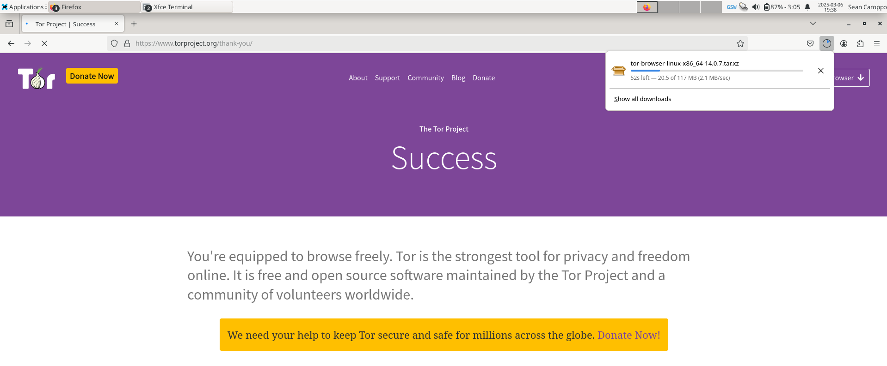
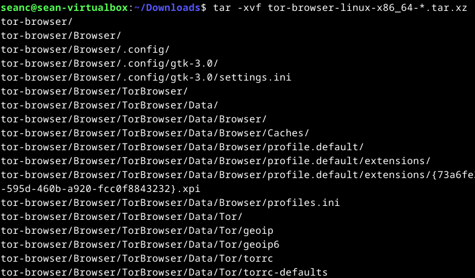
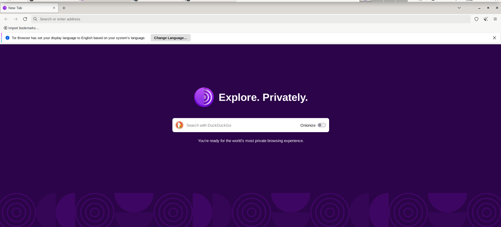

# h7 Going Dark
## 7 Things you should know about TOR
1. The government can't fully break Tor, but they can exploit browser bugs or mistakes made by users. Tor remains a strong privacy tool.
2. Many people use Tor, including activists, journalists, families, and even the military. Criminals have better tools for illegal activities.
3. Tor was originally funded by the U.S. Navy, but it's open-source and has been checked by experts. There's no hidden access for the government.
4. No one has been arrested for running a Tor relay, though exit relays may get law enforcement attention. This is from a US perspective!
5. Tor can be used easily with the Tor Browser or Tails OS, which are simple to set up.
6. Tor is slower than regular internet but has improved over time. More users running relays can help speed it up.
7. If Tor is used incorrectly, one still can be tracked. Therefore it is recommended to avoid logging into personal accounts and always keep software updated.

Tor is a great tool for privacy, but it needs to be used carefully to provide anonymity.

## Shavers & Bair 2016: Hiding behind the keyboard - The TOR Browser
### Introduction
Tor is a web browser that hides a user’s IP address. This makes it hard to track their online activity. 
It is based on Firefox and is easy to use. Anyone can download and use it to browse the internet anonymously.

### History and Intended Use of The Onion Router
Tor was created in 2002 by the U.S. government but is now open for anyone to improve. It helps people bypass censorship and communicate securely. 
Privacy is therefore given. However, it can be used for both good and bad purposes like any other tool. Unfortunately the U.S. government is also trying to find ways to break its anonymity.

### How The Onion Router Works 
Tor is called The Onion Router because its encryption works like peeling layers of an onion. It sends a user’s internet traffic through random relays. 
Each relay removes a layer of encryption before passing it to the next. The last relay, called the exit node connects the user to the final website unencrypted.
Every 10 minutes, Tor changes the relays, making tracking almost impossible. The system works like sending a letter through multiple people, each only knowing where it came from and where it’s going next.

### Tracking Criminals Using TOR
Efforts are being made by governments and agencies to break Tor, but most successes have been achieved by exploiting user mistakes rather than breaking Tor itself. 
Without federal resources, investigations must rely on errors made by suspects. A child pornography site was taken down by the FBI using a Firefox exploit. 

However, Tor itself was not broken. The biggest weakness has been found in the user. 
When settings are changed, scripts are allowed, or plugins are enabled, an IP address can be leaked.

Methods Used to Track Tor Users:
#### E-mail Tracking 
A tracking code can be hidden in an e-mail or document. When opened, the real IP address is captured.

#### Open-Source Research 
A suspect’s username or public details can be linked to their hidden identity.

#### Corporate Networks 
If Tor is used at work, IT staff may detect and match the activity to criminal behavior.

#### Suspect Mistakes Have Led to Arrests
##### Silk Road Case
Ross Ulbricht’s real name and e-mail were used publicly, linking him to his anonymous identity. A life sentence was given.

##### Harvard Bomb Hoax 
A fake bomb threat was sent through Tor, but Harvard’s IT staff identified Tor use at that time. The suspect was caught.

## a) Install TOR browser and access TOR network (.onion addresses)
I downloaded the TOR browser directly from the [TOR project page](https://www.torproject.org/). Afterwards I unziped it with the tar command.

The command tar -xvf tor-browser-linux-x86_64-*.tar.xz extracts the Tor Browser archive. The -x flag tells tar to extract, -v shows the files being extracted, and -f specifies the archive file. The *.tar.xz part uses a wildcard to match the archive filename. The output lists the extracted directories and files, showing the structure of the Tor Browser package.
Btw: tar is a command-line  in Linux used to create, extrac or even  manage archive files: It is often combined with compression formats like .gz for instance.

## b) Browse TOR network, find, take screenshots and comment
### search engine for onion sites
### marketplace
### forum
### a site for a well known organization that has a physical street address in the real world

## c) Voluntary: Browse I2P network. Install necessary software.

## Voluntary: Crypto hunter
Find Bitcoin address from a darknet site. Use the public ledger to find out if money has been transferred to that address.

## References
Things you should know about Tor: https://www.eff.org/deeplinks/2014/07/7-things-you-should-know-about-tor
Shavers & Bair: https://learning.oreilly.com/library/view/hiding-behind-the/9780128033524/XHTML/B9780128033401000021/B9780128033401000021.xhtml#s0020
Task a: https://www.torproject.org/
